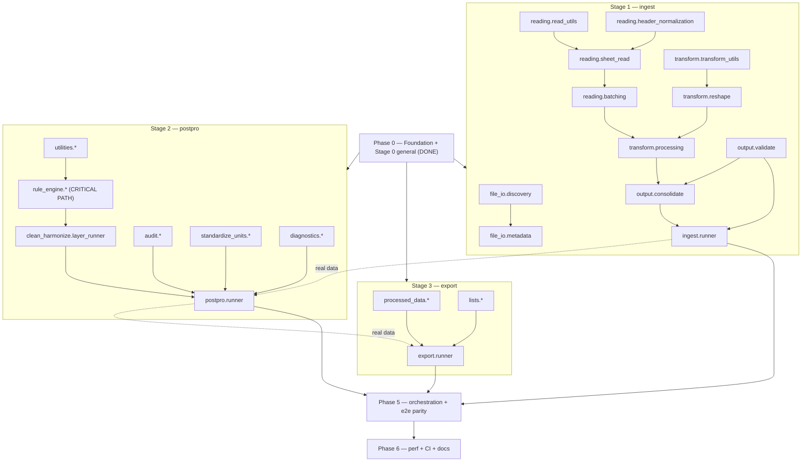

# Migration roadmap

The plan for migrating `whep-digitalization` (R) → `whep-digitize` (Python/polars):
phases, milestones, the dependency DAG, per-module priority/risk/effort, parallel tracks,
and the parity strategy. Companion to [codebase-map.md](codebase-map.md) (per-module status)
and [r-to-python-mapping.md](r-to-python-mapping.md) (how to port + parity risks).

## Guiding principles

1. **Contract-first.** Cross-stage contracts (`contracts.py`) are fixed in Phase 0, so a
   stage can be built and parity-tested against fixtures **before** its upstream stage is
   ported. This is what unlocks parallelism.
2. **Parity is the exit gate.** A module is "done" only when its `@pytest.mark.parity` test
   matches R golden output. Correctness ≥ baseline is non-negotiable.
3. **Bottom-up within a stage.** Leaf helpers before callers (see the DAG).
4. **Critical path = the postpro rule engine.** It is ~half the total effort and gates the
   pipeline end-to-end — start it early, against fixtures, in parallel with ingest.
5. **Parallelizable by design.** Independent modules are migrated by separate agents; the
   roadmap marks which tracks run concurrently.

## Effort unit

A **module-session** = one focused `migrate-module` cycle (read R → implement → test →
parity → gates). Rough sizing by risk: LOW ≈ 0.5, MEDIUM ≈ 1, HIGH ≈ 2 module-sessions.
Totals are estimates for planning, not commitments; **wall-clock is far shorter than the
sum** because tracks run in parallel.

| Phase | Scope | Est. module-sessions |
|-------|-------|----------------------|
| 0 | Foundation + Stage 0 | **done** |
| 1 | Ingest (Stage 1) | ~15–18 |
| 2 | Postpro non-engine (audit, utilities, standardize, diagnostics) | ~14–16 |
| 3 | Postpro rule engine + multi-pass (critical path) | ~14–18 |
| 4 | Export (Stage 3) | ~5–6 |
| 5 | Orchestration, parallelism, progress, end-to-end parity | ~4–6 |
| 6 | Performance, CI hardening, docs finalize | ~3–4 |
| | **Total** | **~55–70** |

---

## Dependency DAG

Solid edges are hard build/dependency order (migrate the source before the target). Dotted
edges are *runtime* data flow only — because contracts are fixed, downstream stages are
built and parity-tested against **fixtures**, so Stages 1/2/3 proceed **in parallel**.

---

## Phases

### Phase 0 — Foundation + Stage 0 — ✅ DONE

Repo, `pyproject.toml` (uv/ruff/mypy/pytest), the full package skeleton, typed contracts,
CLI + orchestrator, and a fully implemented + tested Stage 0 (constants, config,
directories, all helpers). 61 tests, ruff + mypy(strict) green. Docs, guidelines, skills,
and this roadmap.

**Exit (met):** `whep-digitize bootstrap` builds the tree; gates green.

### Phase 1 — Ingest (Stage 1)

**Goal:** `run_import_pipeline(config) -> ImportResult` producing the validated long frame
with parity to R on the fixture corpus.

Milestones (bottom-up, mostly parallel):
- **1a Discovery & metadata** (`discovery`, `metadata`) — LOW/MEDIUM.
- **1b Reading** (`read_utils`, `sheet_read`, **`header_normalization`**, `batching`) —
  header normalization is HIGH (transliteration + ordered regex chain). Do it first with
  golden tests; the rest depend on it.
- **1c Transform** (`transform_utils`, `reshape`, `processing`) — HIGH; the wide→long
  `unpivot` and the fused parallel path. Depends on 1b for real input but can start against
  fixtures immediately.
- **1d Output** (`validate`, `consolidate`) — `validate_long_dt_by_document` is HIGH
  (ordering + verbatim error strings). Independent of 1b/1c against fixtures.
- **1e Runner + parallelism** — wire the fused read+transform, sequential first.

**Exit:** ingest runner returns a parity-correct `ImportResult` on the fixture corpus;
sequential and (later) parallel produce identical output.

### Phase 2 — Postpro non-engine

**Goal:** everything in Stage 2 except the rule engine + multi-pass driver. All parallel.
- **2a Audit** (`audit`, `validation`, `config`, `export`) — value→Float64 + retained
  invalid rows + the parse/regex divergence; styled Excel export.
- **2b Utilities** (`output_roots`, `diagnostics`, `templates`, `payload_cache`).
- **2c Standardize units** (`engine` HIGH, `rules_setup`, `aggregation`, `orchestration`) —
  prefix fold + two-stage match + affine convert + aggregation. Self-contained; parallel.
- **2d Diagnostics** (`preflight`, `output`, `rule_summaries`, `standardize_summaries`).

**Exit:** audit + standardize + diagnostics each parity-correct against fixtures.

### Phase 3 — Postpro rule engine + multi-pass (critical path)

**Goal:** the algorithmic heart. Bottom-up:
- **3a** `matching_strategy` → `matching_values` (HIGH) → `target_apply` (HIGH).
- **3b** `schema_validation` (MED-HIGH), `payload_application`.
- **3c** `conditional_group` (HIGH) and `footnote_rules` (HIGH, hardest single port).
- **3d** `clean_harmonize.controls_cache` (cycle detection via content hash) +
  `layer_runner` (multi-pass driver) + `stage_inputs`.

**Exit:** clean and harmonize layers parity-correct on rule fixtures, including multi-pass
convergence and cycle detection.

### Phase 4 — Export (Stage 3)

- **4a** `processed_data.layers` + `export` (layer detection + TSV).
- **4b** `lists.unique_values` + `merge` + `write` (per-column multi-sheet xlsx, identical
  layer merging). `export.runner` + `assert_export_paths_contract`.

**Exit:** processed TSVs and unique-list workbooks parity-correct against fixtures.

### Phase 5 — Orchestration, parallelism, progress, end-to-end parity

- Wire `run_pipeline` through all four real stages.
- Add `ProcessPoolExecutor` parallelism to ingest (fused) and list export, preserving
  deterministic order independent of worker count; graceful sequential fallback.
- `rich.progress` bars for each stage runner.
- **End-to-end parity** on the real (frozen) dataset: run R + Python on the same inputs,
  diff processed TSVs and unique lists to zero differences.

**Exit:** `whep-digitize run` produces byte-identical outputs to the R pipeline on the
frozen dataset.

### Phase 6 — Performance, CI, docs

- Benchmark harness under `benchmarks/`; profile; enable the perf metric in `autocode.toml`.
- Harden CI (matrix, coverage gate). Generate/commit `uv.lock`.
- Finalize docs; retire scaffolding notes.

---

## Parallel tracks (who can work at once)

Because contracts are fixed and each stage is parity-tested against fixtures, up to **four
tracks run concurrently** after Phase 0:

| Track | Modules | Notes |
|-------|---------|-------|
| A — Ingest | Stage 1 (Phase 1) | Start header_normalization + validate first (both HIGH, independent) |
| B — Rule engine | Stage 2 rule_engine + multi-pass (Phase 3) | **Critical path — start immediately**, against rule fixtures |
| C — Postpro non-engine | audit, standardize_units, diagnostics, utilities (Phase 2) | Each sub-area independent |
| D — Export | Stage 3 (Phase 4) | Smallest; can start against fixtures anytime |

Within a track, the DAG gives the order. Cross-track integration happens in Phase 5.
Recommended sequencing if run by a single developer: **B (rule engine) and A (ingest) first
and in parallel**, then C and D, then Phase 5.

## Priority / risk / effort by module

See the per-module tables in [codebase-map.md](codebase-map.md) (R source + risk). The
HIGH-risk modules — and therefore the ones to schedule first within their track and to
give the most parity scrutiny — are:

- Ingest: `header_normalization`, `transform_utils`, `reshape`, `processing`, `validate`.
- Rule engine: `matching_values`, `target_apply`, `conditional_group`, `footnote_rules`,
  `layer_runner`, `controls_cache`.
- Standardize: `engine`.

## Parity strategy

1. **Freeze inputs.** The live dataset grows; snapshot a fixed corpus (plus small synthetic
   fixtures covering edge cases) for all A/Bs and parity tests.
2. **Golden files from R.** Use the `parity-check` skill to run the R function and save
   outputs under `tests/golden/<module>/`. Goldens are gitignored (regenerable) but their
   generating fixtures are committed.
3. **Module-level parity** during each port (`@pytest.mark.parity`), then **stage-level**,
   then **end-to-end** in Phase 5.
4. **Transliteration** (`anyascii` vs ICU `Latin-ASCII`) is the pervasive risk — parity-test
   normalization on accented/unicode data before anything downstream relies on match keys.

## Risks & mitigations

| Risk | Mitigation |
|------|------------|
| Transliteration divergence silently breaks rule matching | Golden-test `normalize_string` on real accented data first; explicit overrides + regression tests for divergences |
| `melt`→`unpivot` drops/keeps different columns | Recompute year columns explicitly; assert column set in parity tests |
| Non-deterministic ordering across workers | `sort_pipeline_stage_dt` everywhere; parity test sequential vs parallel |
| Rule-engine complexity (7 HIGH modules) underestimated | Start earliest; migrate strictly bottom-up; heavy fixture coverage per module |
| R `serialize()` cycle detection has no portable analogue | Replace with deterministic content hash; rely on the cheap `changed_value_count==0` early stop as primary convergence signal |
| Live dataset drift invalidates goldens | Freeze the corpus; regenerate goldens only on an intentional, recorded refresh |

## Definition of done (whole migration)

`whep-digitize run` on the frozen dataset produces **byte-identical** processed TSVs and
unique-list workbooks to the R pipeline; all module + stage + e2e parity tests pass; ruff +
mypy(strict) + pytest green in CI; `uv.lock` committed; docs current.
